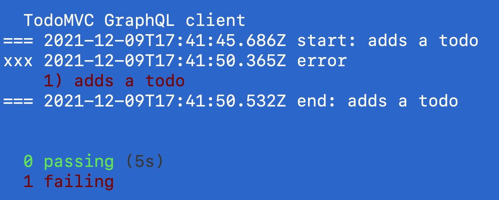
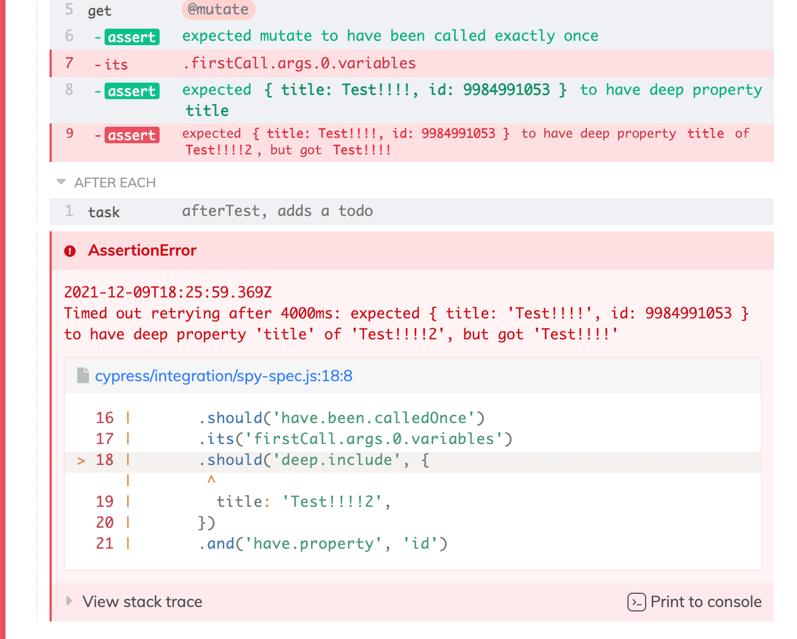
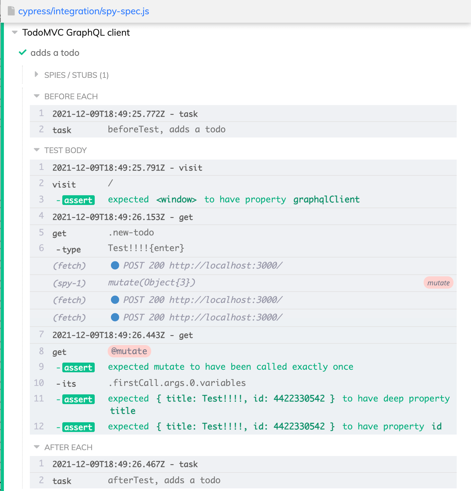
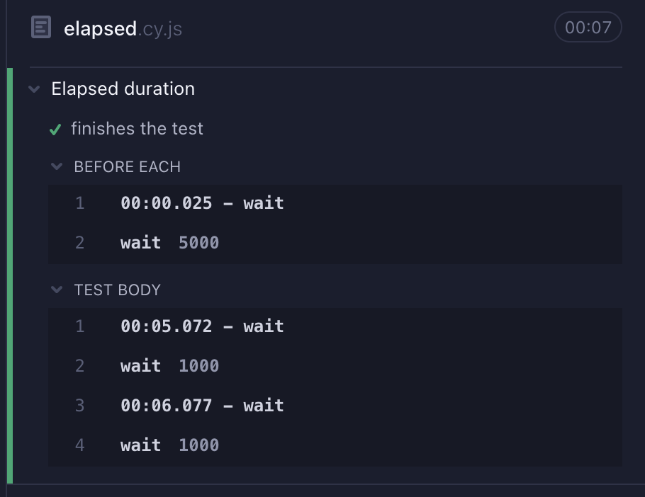
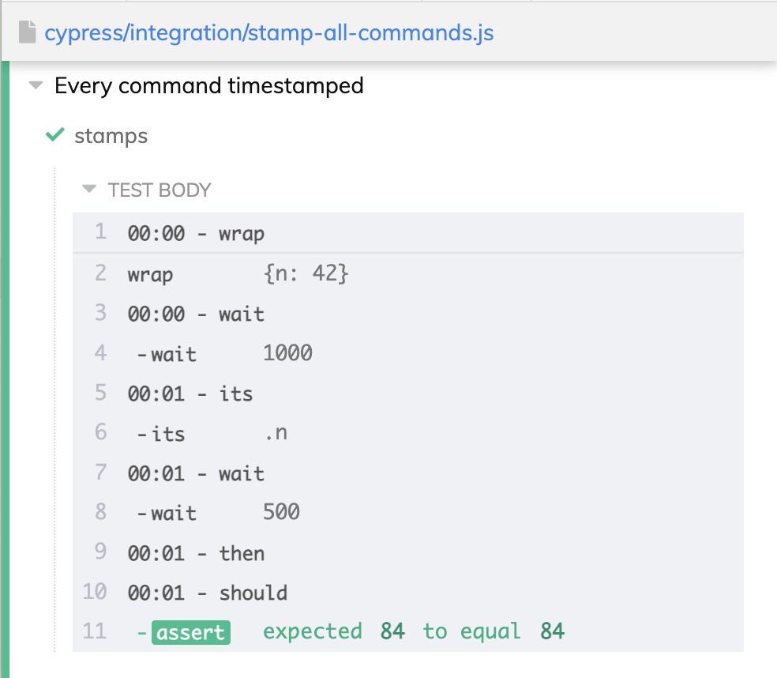

# cypress-timestamps 

> Add timestamps to Cypress tests, error screenshots, and Command Log

Read the blog post [Add Timestamps To Cypress](https://glebbahmutov.com/blog/cypress-timestamps/)

## Install

```shell
$ npm i -D cypress-timestamps
# or if using Yarn
$ yarn add -D cypress-timestamps
```

## Use

Include the plugin from your support file

```js
// cypress/support/e2e.js

// https://github.com/bahmutov/cypress-timestamps
require('cypress-timestamps/support')()
```

Include this plugin from your project's Cypress config file. This is optional and is needed only if you enable the option `terminal: true` (see below)

```js
// cypress.config.js

const { defineConfig } = require('cypress')

module.exports = defineConfig({
  fixturesFolder: false,
  e2e: {
    setupNodeEvents(on, config) {
      // https://github.com/bahmutov/cypress-timestamps
      return require('cypress-timestamps/plugin')(on, config)
    },
  },
})
```

## Options

By default, this plugin adds the timestamps to the error message if a test fails, and to the parent commands in the Command Log. You can also enable printing the test start and end timestamps in the terminal by registering the plugin (see above) and enabling the option when registering the support file.

```js
// cypress/support/e2e.js

// https://github.com/bahmutov/cypress-timestamps
require('cypress-timestamps/support')({
  terminal: true,
  error: true,
  commandLog: true,
})
```

### terminal

Prints timestamps around each test, prints a timestamp of the screenshot taken on test failure



### error

Adds the timestamp to any error thrown by the test



### commandLog

Adds timestamps before each parent command that starts a new chain of commands



### elapsed

When printing the timestamps to the command log, you can print either the absolute timestamp (by default), or the time since the test has started.

```js
// https://github.com/bahmutov/cypress-timestamps
require('cypress-timestamps/support')({
  commandLog: true,
  elapsed: true,
})
```



### Stamp all commands

By default, only the parent and dual commands get a timestamp in the Command Log to avoid verbose clutter. You can enable stamping every command using the `commandLog: "all"` option.

```js
// https://github.com/bahmutov/cypress-timestamps
require('cypress-timestamps/support')({
  commandLog: 'all',
  elapsed: true,
})
```



**Tip:** looking to slow down your Cypress tests? Use my [cypress-slow-down](https://github.com/bahmutov/cypress-slow-down) plugin.

## Small print

Author: Gleb Bahmutov &lt;gleb.bahmutov@gmail.com&gt; &copy; 2021

- [@bahmutov](https://twitter.com/bahmutov)
- [glebbahmutov.com](https://glebbahmutov.com)
- [blog](https://glebbahmutov.com/blog)
- [videos](https://www.youtube.com/glebbahmutov)
- [presentations](https://slides.com/bahmutov)
- [cypress.tips](https://cypress.tips)

License: MIT - do anything with the code, but don't blame me if it does not work.

Support: if you find any problems with this module, email / tweet /
[open issue](https://github.com/bahmutov/cypress-timestamps/issues) on Github

## MIT License

Copyright (c) 2021 Gleb Bahmutov &lt;gleb.bahmutov@gmail.com&gt;

Permission is hereby granted, free of charge, to any person
obtaining a copy of this software and associated documentation
files (the "Software"), to deal in the Software without
restriction, including without limitation the rights to use,
copy, modify, merge, publish, distribute, sublicense, and/or sell
copies of the Software, and to permit persons to whom the
Software is furnished to do so, subject to the following
conditions:

The above copyright notice and this permission notice shall be
included in all copies or substantial portions of the Software.

THE SOFTWARE IS PROVIDED "AS IS", WITHOUT WARRANTY OF ANY KIND,
EXPRESS OR IMPLIED, INCLUDING BUT NOT LIMITED TO THE WARRANTIES
OF MERCHANTABILITY, FITNESS FOR A PARTICULAR PURPOSE AND
NONINFRINGEMENT. IN NO EVENT SHALL THE AUTHORS OR COPYRIGHT
HOLDERS BE LIABLE FOR ANY CLAIM, DAMAGES OR OTHER LIABILITY,
WHETHER IN AN ACTION OF CONTRACT, TORT OR OTHERWISE, ARISING
FROM, OUT OF OR IN CONNECTION WITH THE SOFTWARE OR THE USE OR
OTHER DEALINGS IN THE SOFTWARE.
